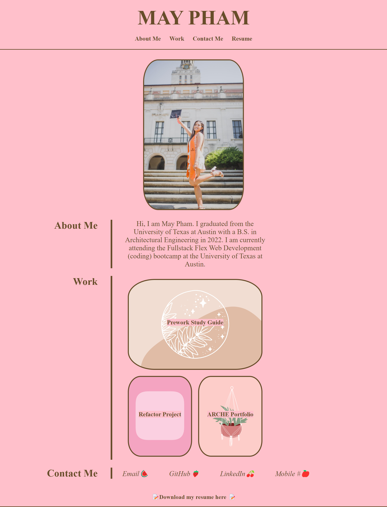

# maypham-portfolio

## Description
The portfolio was created to showcase May Pham's skills, projects, and experiences while attending the UT Austin coding bootcamp. The purpose of this personal portfolio website is to present a professional and visually appealing showcase of May Pham's work to potential clients, employers, or collaborators. The site includes projects and information regarding how to get in contact with May Pham.

## Usage

https://mayphamx.github.io/maypham-portfolio/

https://github.com/mayphamx/maypham-portfolio