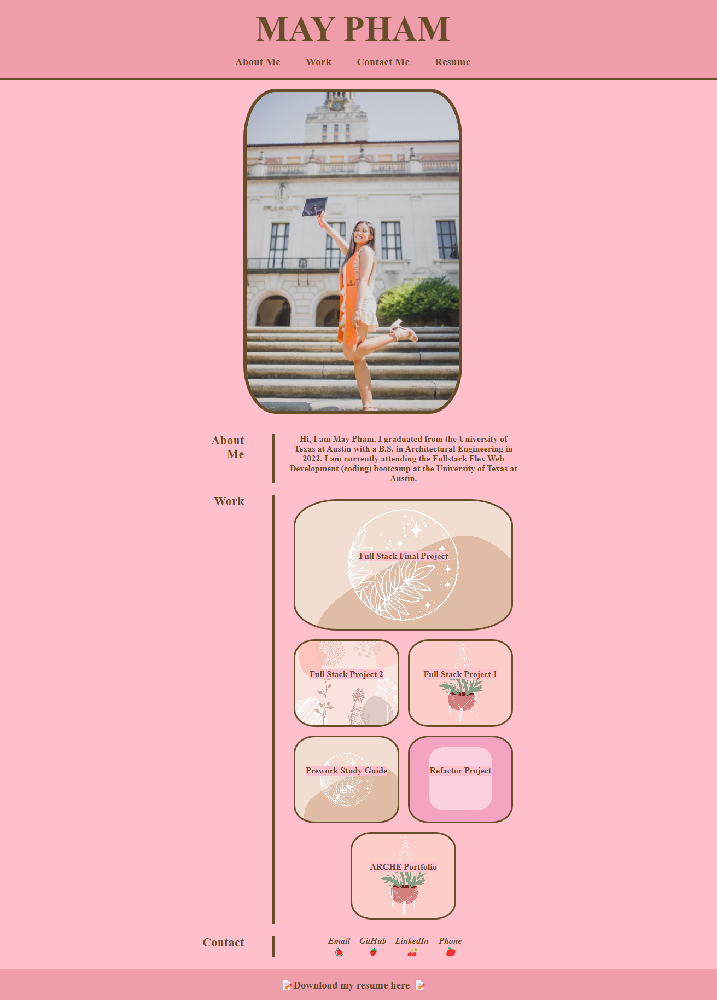

# Professional-Portfolio-MP

## Description
This project was developed as a dedicated portfolio for showcasing May Pham's skills, projects, and experiences during their enrollment in the UT Austin coding bootcamp. The primary objective of this personal portfolio website is to offer a polished and visually engaging platform for presenting May Pham's body of work to prospective clients, employers, or potential collaborators. The site encompasses an array of projects and provides comprehensive information on how to reach out to May Pham.

## Usage

 Check out the deployed link here: https://mayphamx.github.io/Professional-Portfolio-MP/

Visit the GitHub repo here: https://github.com/mayphamx/maypham-portfolio
